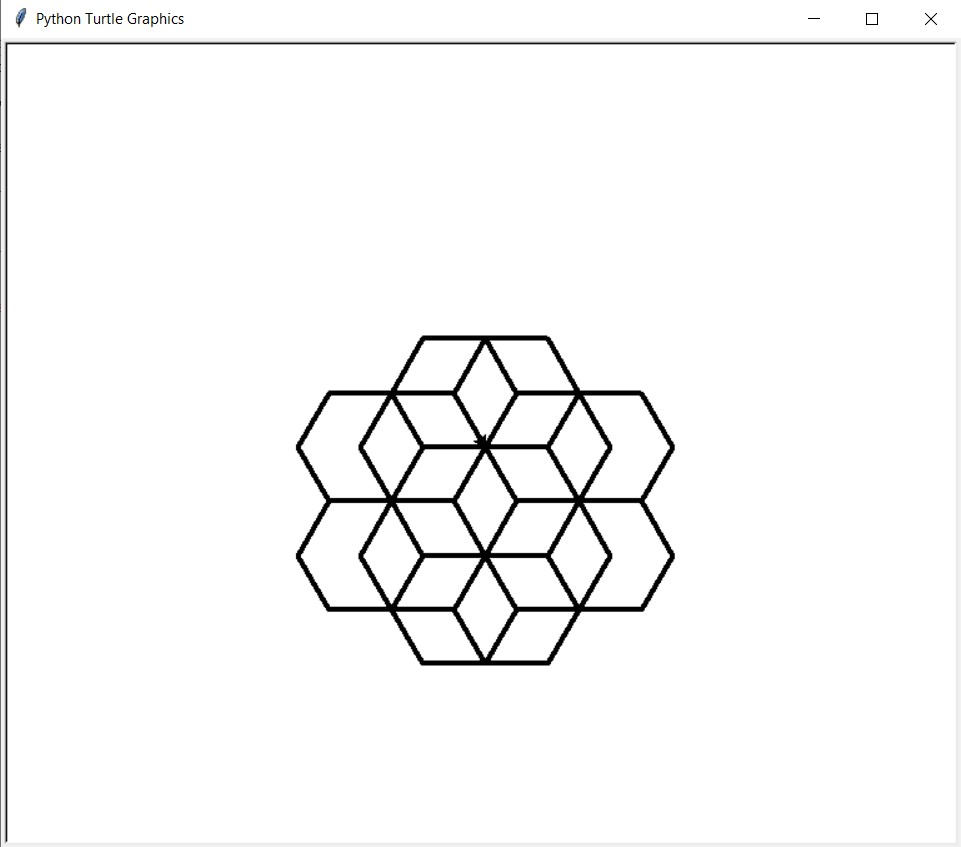

 <h1> Homework 1: Turtle Drawing </h1>

### Description:
  
This was an easy introductory assignment to the class. We were tasked to use the turtle module to draw a circle of hexagons with the use of a function we created to draw this pattern
 
We were then tasked to use the function we had designed to print this pattern twice, with the second iteration of the pattern being shifted a bit to the right.
  
### Output:
 
 

