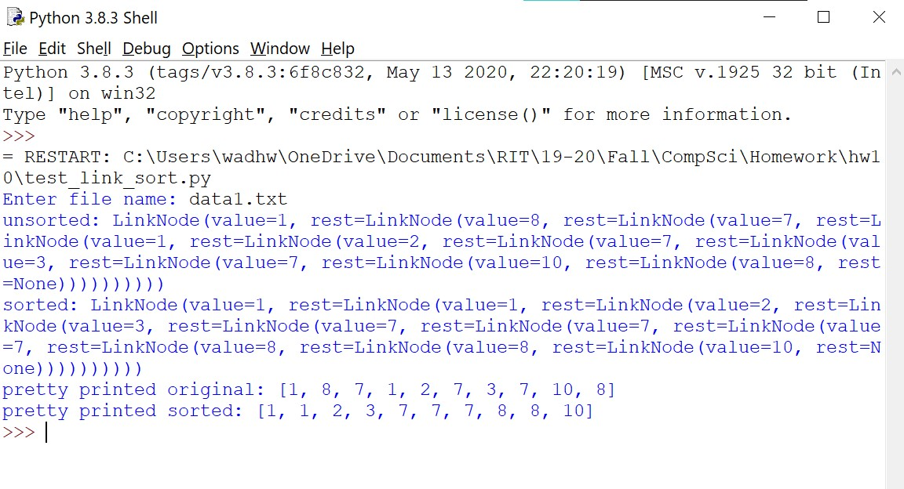

 <h1> Homework 10: Linked Lists </h1>

### Description:
  
We were tasked to write a program that implements Linked Lists as well as some additional functions such as sorting the nodes by value and printing the linked list. The implementation of linked lists is done in linked_code.py (done in class), additional functionalities are within the linked_insort.py, and the testing of all functionalities occurs in the test_link_sort.py. 
  
### Output:
 
 
