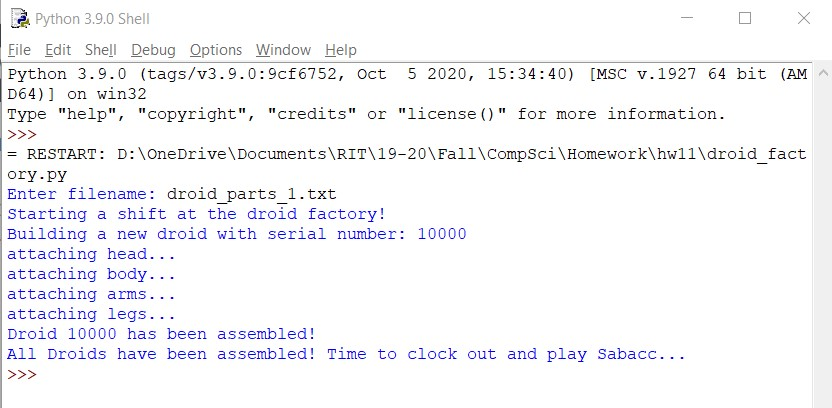

 <h1> Homework 11: Droid Factory </h1>

### Description:
  
We were tasked to write a program that will use a queue to implement an assembly line at a droid factory. Droids comprise four different parts: a pair of arms, a pair of legs, a body, and a head (the arms and legs each come in connected pairs that can be affixed to the body). An assembly line at the droid factory consists of a circular conveyor belt at the center of which stands a droid factory worker. As droid parts pass by on the conveyor, the worker uses them to assemble droids.
 
The program, denoted as droid _factory.py, has a main function that takes user input for the text file containing droid parts and uses that to build all the droids. The cs_queue.py and node.py are used to implement the queue data structure. These files are used to implement the droid factory.
  
### Output:
 
 
