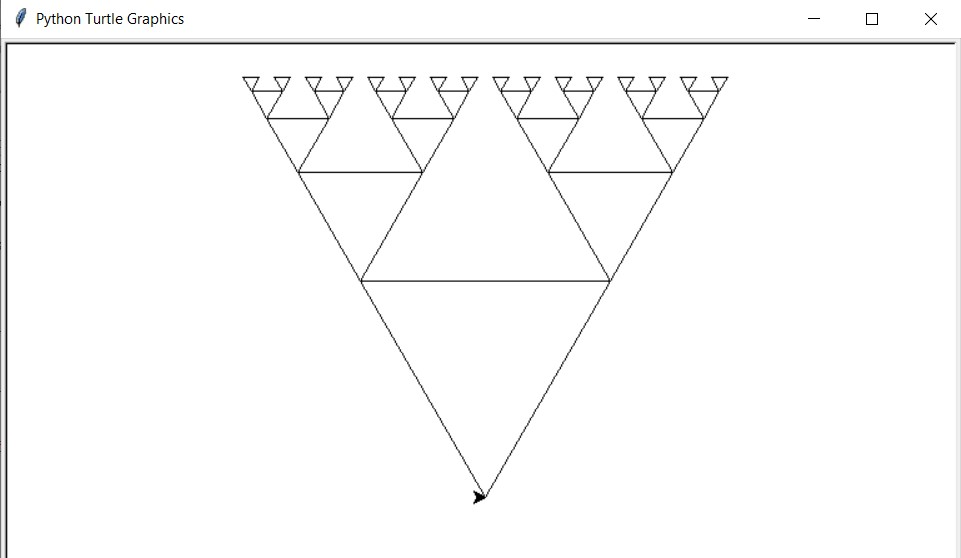

 <h1> Homework 3: Recursive Triaingle Drawing </h1>

### Description:
  
We were tasked to write a function that draws shrinking traingles recursively. The main function would take in user input for the starting side length and the deoth of the recursion of the shrinking triangles.
  
### Output:
 
 
