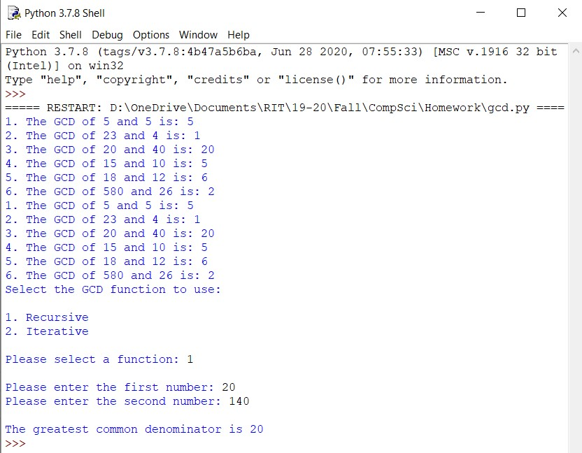

 <h1> Homework 4: Greatest Common Denominator (GCD) </h1>

### Description:
  
We were tasked to write a function that computes the greatest common denominator between two numbers. The assignment calls for two variations of the fucntion: one itertive and one recursive. The main function would allows the user to choose which function (iterative or recursive) he or she would want to use and also ask for input of two numbers to plug into said function.
 
The program file also includes at 6 diverse tests for both the iterative and recursive function.
  
### Output:
 
 
