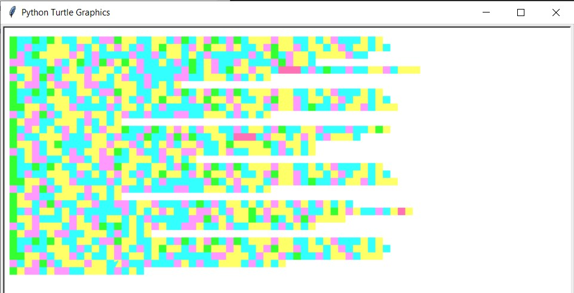

 <h1> Homework 5: Song Drawing </h1>

### Description:
  
We were tasked to write a program that reads the lyrics of a song from a text file and uses the turtle package to draw a picture of the song with a colorful square for each letter. The length of each line defines the ‘shape’ of the text and shall be preserved by a ragged-right-edge display in the picture.
  
### Output:
 
 
