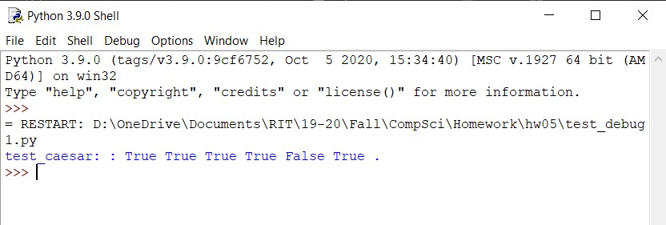
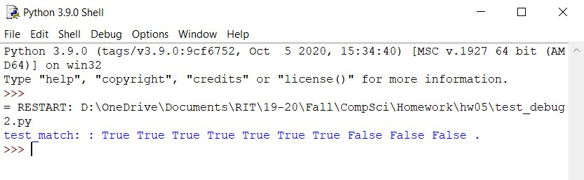

 <h1> Homework 5: Testing and Debugging </h1>

### Description:
  
We were tasked to test, debug, and fix 2 program files. The first file, denoted as test_debug1.py, describes a program for a Caesar Cipher. The other program file, denoted as test_debug2.py, describes a program to find the longest consecutive matching substring between two strings. There were also some additional homework questions to which were to document our findings named Responses.pdf.
  
### Output for Test_Debug1:
 
 
### Output for Test_Debug2:
 

