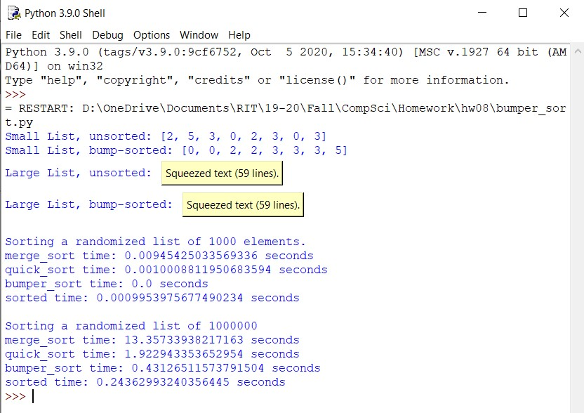

 <h1> Homework 8: Bumper Sort </h1>

### Description:
  
We were tasked to implement and visually compare 4 sorts: quick sort, merge sort, bumper sort, and linear sort. Quick sort and merge sort were implemented in class, hence their own program files. The bumper sort file contains the implementation of bumper and linear sort as well as the comparison between all sorts.
  
### Output:
 
 
