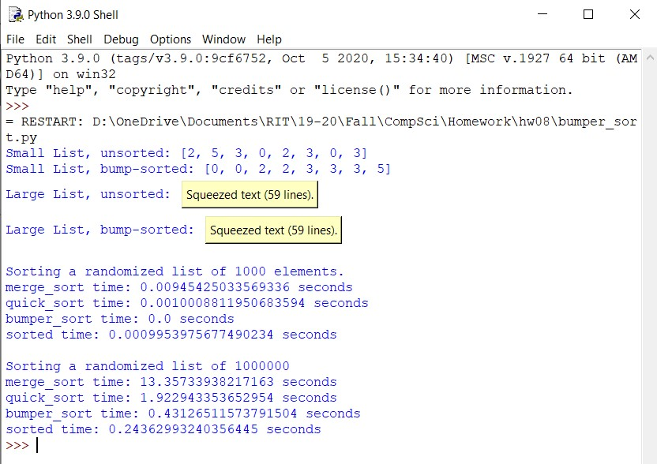

 <h1> Homework 9: Birthdays </h1>

### Description:
  
We were tasked to write a program to store birthdays using both a user-defined structure and a dictionary.There were other functions such as a toString, birthday_atleast which returned a list of birthday objects that occurred at least a given number of times. The main function would take in user input for a file that contained birthdays and tested all functionalities.
  
### Output:
 
 
