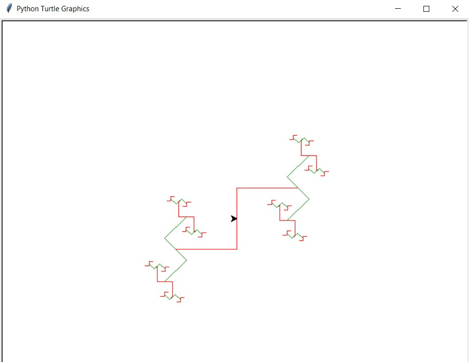

 <h1> Lab 3: Zigzag</h1>

### Description:
  
We were tasked to write a program that draws figures like the picture shown below using recursion. When run, the program must prompt for the recursion depth, and then draw the figure so that it fits in the standard canvas window. We were to assume that depth will always be non-negative.

### Output:
 
 
