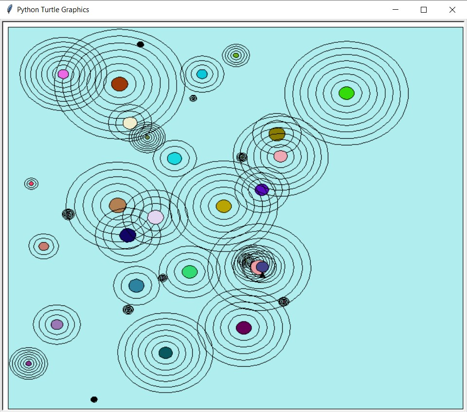

 <h1> Lab 4: Raindrops </h1>

### Description:
  
We were tasked to write a program to generate a colorful sequence of raindrops rippling on a smooth pond (the blue bounding box) using recursion.

### Output:
 
 
