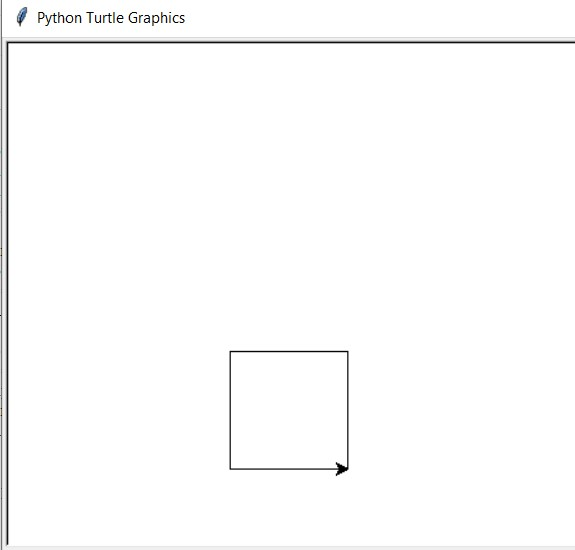

 <h1> Lab 5: Turtle Drawing </h1>

### Description:
  
We were tasked to write a program that interprets an input series of symbols as a language and to execute them as various actions made in the turtle module. The commands are stated as comments in the beginning of the program file. 
  
### Output:
 
 
