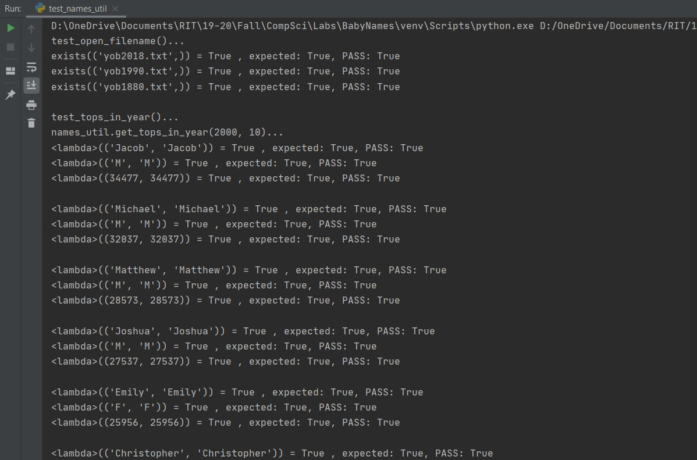

 <h1> Lab 7: Baby Names </h1>

### Description:
  
We were tasked to write a program that can processes text files full of birthdates and names of children born using dataclasses and dictionaries. We were also tasked to implement functions that would extract the top names of babies that were born in a given year as well as a function to return the top most name, male or female, in a given year. The program where all these functionalities are implemented is the names_util.py program. The rest of the programs test the functionalities implemented.
  
### Output (using test_names_util.py) :
 
 
