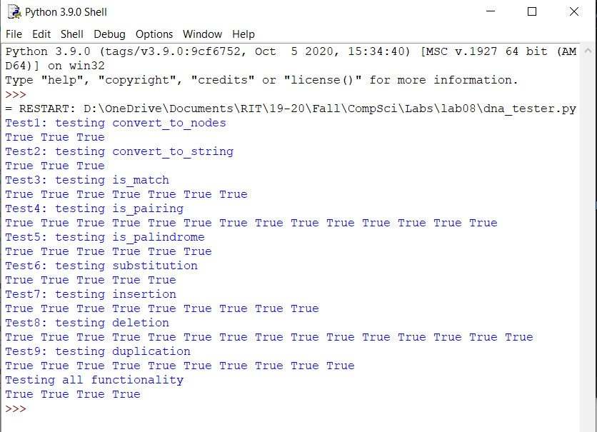

 <h1> Lab 8: DNA </h1>

### Description:
  
We were tasked to write a program that implements a representation of DNA using linked lists. We were also to implement various functionalities commonly associated with DNA such as segment substitution, insertion, deletion, and duplication. The program also contains functions that test a pair of DNA for matches and if they are pairs. 
 
There is also a tester file named dna_tester.py to test all functionalities previously mentioned.
  
### Output:
 
 
