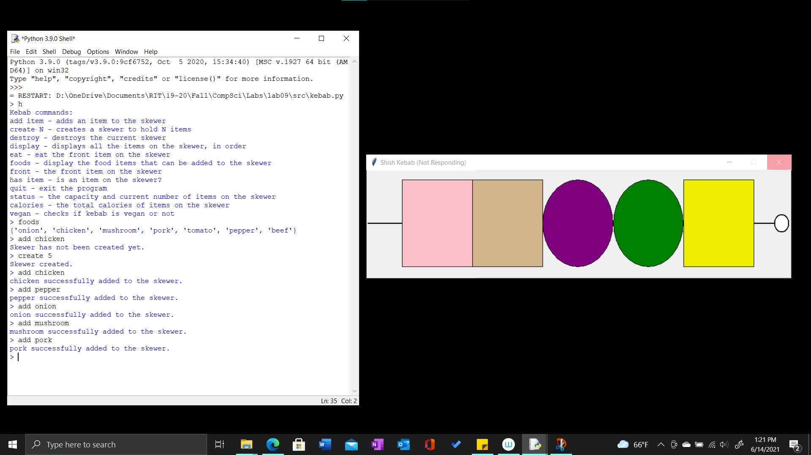

 <h1> Lab 9: Kebab </h1>

### Description:
  
We were tasked to implement a representation of kebabs and take user input in the command line that would build, eat, and destroy kebabs as the user pleases. The project also contains a graphical portion that visualizes the kebabs throughout the execution of the program. 
 
The program file kebab.py contains the main function that takes user commands to test the functionalities
  
### Output:
 
 
