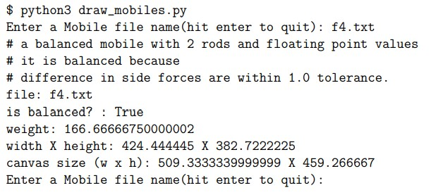
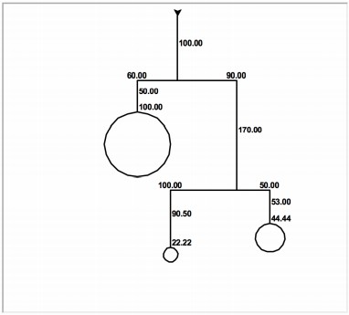

 <h1> Lab 10: Mobiles </h1>

### Description:
  
We were tasked to o write a program that reads a file containing a mobile specification, constructs and assembles the mobile, and reports the balance (True/False), weight, height and width of the mobile, and finally draws the mobile using Python’s turtle graphics. These mobiles will be implemented using trees.
  
The text files are used as input for building the mobiles and are to be used as arguments when running draw_mobiles.py
  
### Output:
 
 
  
 
